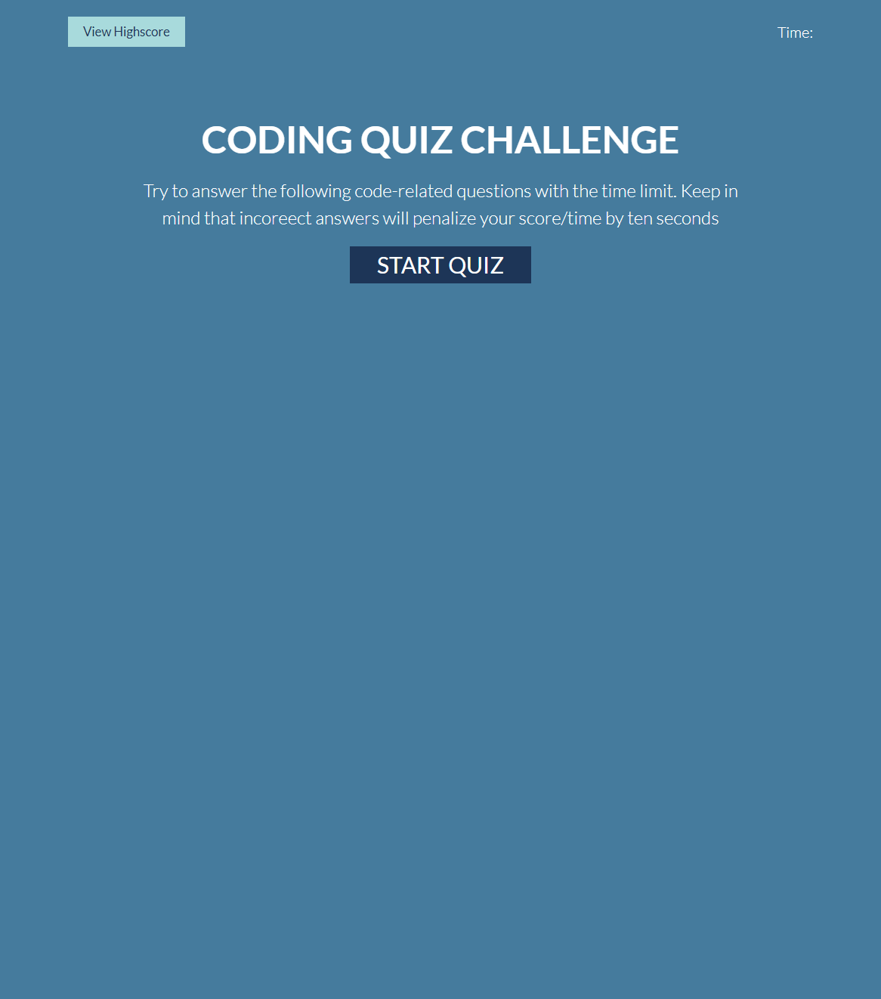

# 04-web-apis-code-quiz

In this project I built a quiz game from scratch. Created the HTML, CSS and javaScript pages. First I added the HTML content that I needed to make it work which was the starting screen container, question container, game over screen container and the highscore screen container. These all had elements inside them to be displayed on the page. I Styled it with CSS and I used flex box for the layout. In the javaScript I created the functionality of the quiz using functions, local storage, DOM, arrays, objects, for loops and more. 

- Created the HTML page

- Created and implemented the style sheet to style the HTML page.

- Created the javaScript page to add functionality to the quiz

- Used function, local storage, DOM, array, object, for loops and more.

# Screenshot
 

 

# Deployment Link

Below is the deployment github pages link.

[03-homework-deployment-link](https://itiskchengs.github.io/04-web-apis-code-quiz/)